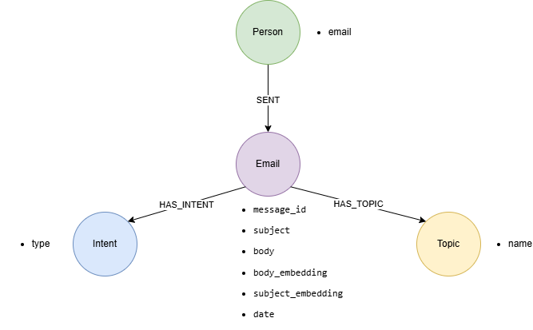
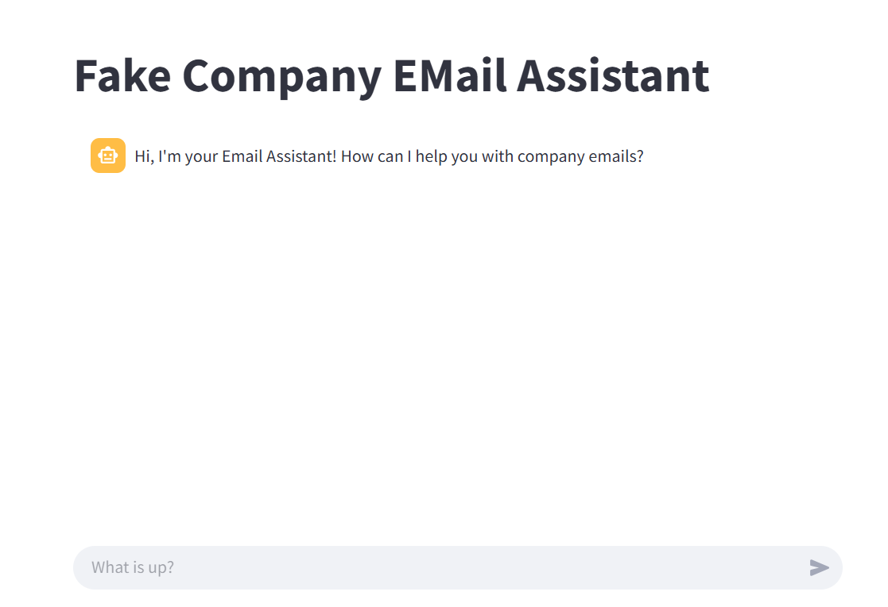
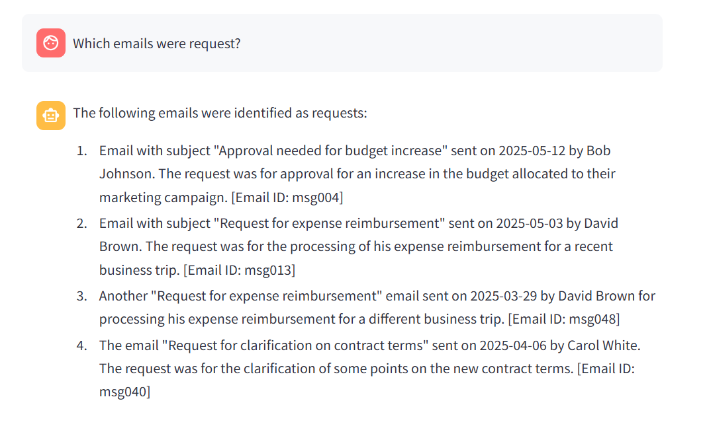
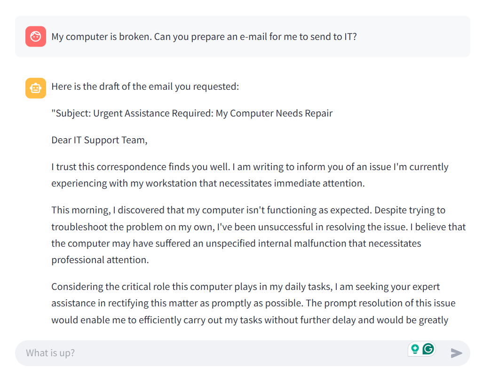
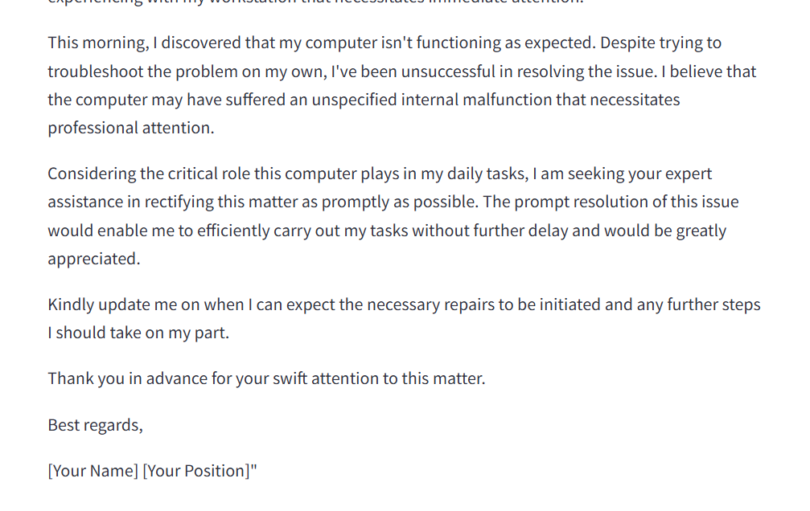
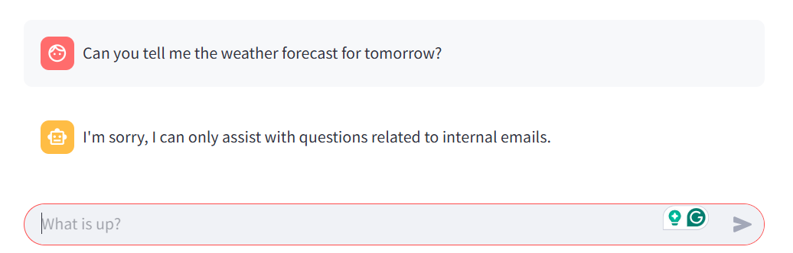

# NewMindAI_Patika_FinalProject
# Streamlit Tabanlı, LLM Destekli Knowledge Graph Chatbot - Email Assistant

---

## Proje Amacı

- Şirket içi e-posta iletişimlerini analiz etmek.
- E-posta niyetlerini otomatik olarak çıkarmak.
- Kullanıcıların doğal dilde e-postalarla ilgili sorularına yanıt vermek.
- Kullanıcılara istenilen konularda email hazırlanarak vakit kazancı sağlamak.
- Olası iletişim problemlerinin önüne geçmek.
- Şirket ekosistemine uygun üslupta email iletişimini sağlamak.

---

## Teknoloji ve Araçlar

- **Streamlit:** Kullanıcı arayüzü.
- **Neo4j:** Graph veri tabanı.
- **LangChain:** LLM ve sorgu zincirleri.
- **OpenAI Chat API:** LLM olarak doğal dil işleme.
- **Python:** Tüm backend ve entegrasyon kodları.
- **Vector Embedding:** E-posta metinlerinin vektörel gösterimleri için OpenAI embeddings.

---

## Veri Modeli

| Node Türü | Özellikler                               |
|-----------|----------------------------------------|
| Person    | email                  |
| Email     | message_id, subject, body, body_embedding, subject_embedding, date |
| Topic     | name                                   |
| Intent    | type  |

### İlişkiler

- (p:Person)-[:SENT]->(e:Email)
- (e:Email)-[:HAS_TOPIC]->(t:Topic)
- (e:Email)-[:HAS_INTENT]->(i:Intent)

---

## Kurulum & Çalıştırma

### Gereksinimler

- Python 
- Neo4j 
- OpenAI API Key

### Kurulum

1. Repoyu klonlanlayın
2. Sanal ortam oluşturun ve requirements.txt dosyasındaki gerekli paketleri yükleyin
3. .streamlit/secrets.toml dosyasını oluşturun ve "NEO4J_URI", "NEO4J_USERNAME", "NEO4J_PASSWORD", "OPENAI_API_KEY" ve "OPENAI_MODEL" bilgilerinizi tanımlayın 
4. Neo4j veri tabanına mimaride belirtilen şekilde CSV ile veri aktarımı yapın.
5. Uygulamayı başlatın: **Streamlit run bot.py**

### Kullanım
- Arayüzden sorularınızı yazabilirsiniz.

- Sistem soruyu LLM yardımıyla Cypher sorgusuna dönüştürür.

- Neo4j’den gelen sonuçlar doğal dilde yanıt olarak döner.

- E-posta içeriklerine göre benzer mail araması ve taslak mail oluşturma araçları mevcuttur.

## Uygulama Resimleri
### Ana sayfa

### Analiz

### Email Oluşturma

### Alakasız Soru Sorma
